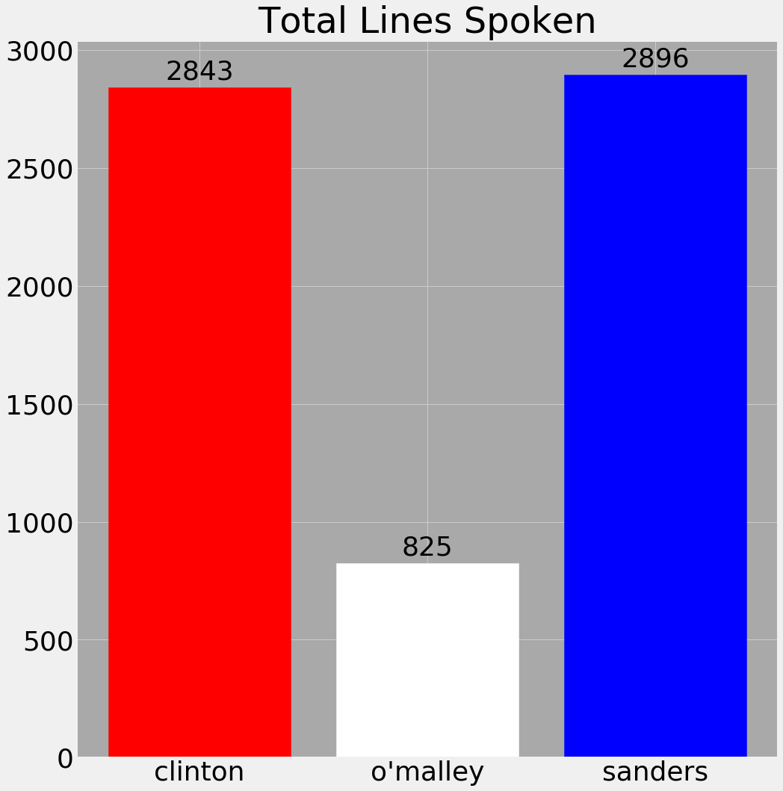

# Discerning the Debate

## Overview

### The Data
Using the full debate transcripts provided by Politico.com and The American Presidency Project hosted at the University of California, Santa Barbara, each line was recorded into a dataset through webscraping and cleaning processes. Debates contained up to 20,000 words, equating to about 11000 sentences as rows of data in total. 11 debates were used for the analysis.
### EDA
Inital exploration was centered around Hillary Clinton's data throughout the primary debates as well as her debates against Donald Trump. The total number of sentences said per candidate for the primaries are shown below:

Clearly there are two main candidates considering the primaries, with Hillary Clinton and Bernie Sanders speaking the most lines compared to Martin O'Malley. Considering the debates are meant to give the most prominent candidates equal time to speak, this data is appropriate.

Below is the count between Hillary Clinton and Donald Trump during the main presidential debates:

Interestingly, the divide is much larger when there are only two candidates supposed to give equal time. This could be due to numerous factors, such as sentence length, and rebuttals spoken outside of the candidate's allocated time to speak.

In terms of word counts, the following were the most common words for the primaries:

Similar words can be found in the presidential debate count:

Noting some words that are the most frequent seem that they should be associated with other words, such as "street". This will be accounted for later in the analysis.

## Analysis
### Speaker Classification
Initial attempts at analysis involved creating a classification model to discern the speech between Trump and Clinton during the 2016 election. Two models were considered at first, both Multinomial Naive Bayes and Logistic Regression, to predict the speaker using the three Presidential Debates not including the primary. The ROC Curves and Precision-Recall Curves for these models are provided below.

### Audience Reaction Prediction
Further analysis involved predicting which terms and lines spoken lead to audience reaction and applause. In total, the audience applause indicators, in which the transcripts explicitly noted "[applause]" and in other similar ways. Lines that contained these indicators or led to sole moments of applause were considered to be the lines leading to the applause. However, in total, the total instances of applause equated to less than 10% of the rows in the data, therefore, undersampling and oversampling methods were used for analysis.